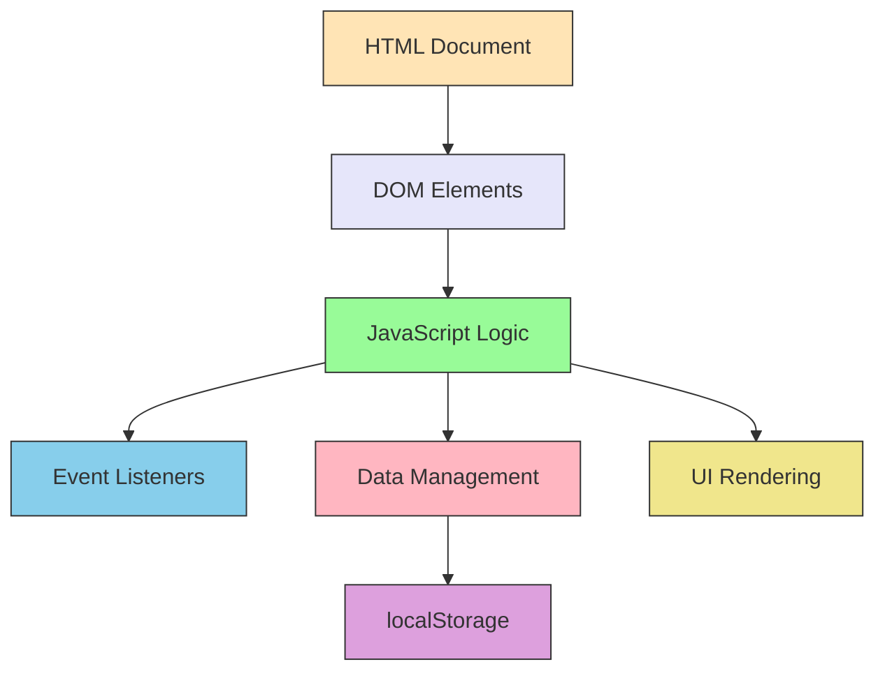
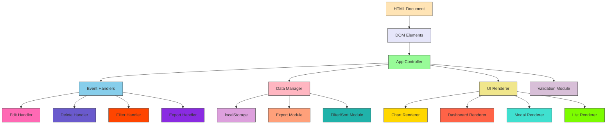

# ExpenseNote Application Architecture

## Current Architecture

## Planned Architecture After Improvements

## Key Improvements

1. **Modular Structure**: Separation of concerns with distinct modules for different responsibilities
2. **Enhanced Data Management**: Additional modules for filtering, sorting, and exporting
3. **Improved UI Rendering**: Specialized renderers for different UI components
4. **Validation Layer**: Dedicated module for input validation
5. **Event Handling**: More specific handlers for different actions
6. **Data Visualization**: Dedicated chart and dashboard renderers

This architecture will make the application more maintainable, scalable, and easier to extend with new features.